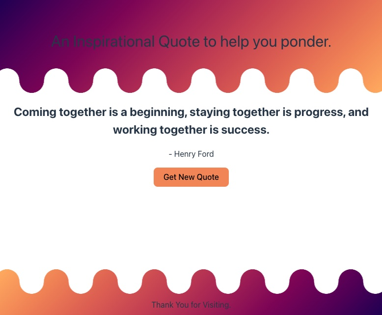

# Inspirational Quote

## Description

An Inspirational Quote to help you ponder. Quotes include words of wisdom, simple uplifting messages, and much more. This was a simple project I built to practice a few skills. The main skills I wanted to touch on are vue 3 framework, api use, and simple css.

## Installation

Clone the application to whichever directory you would like to store it on your computer. Once cloned, open the dirctory in your preferred text editor. Then:

npm install

npm run dev

This will install the applications packages. Then launch it.

## Acknowledgements

This project was built using the Quotes api on RapidAPI. You can find it here:

https://rapidapi.com/martin.svoboda/api/quotes15

The wavy border on the top and bottom was built with the following generator:

https://css-generators.com/custom-borders/

## Licenses

There is no licenses for this project.
